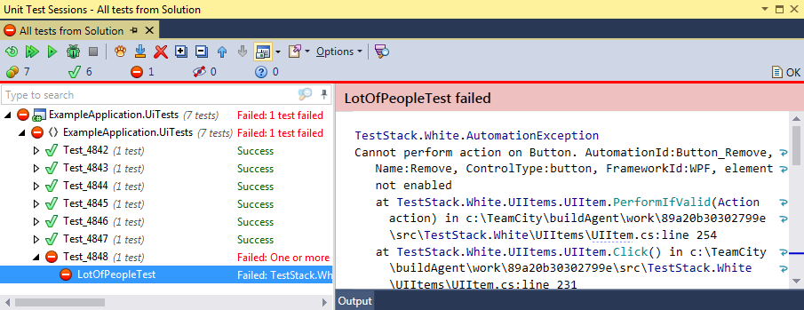
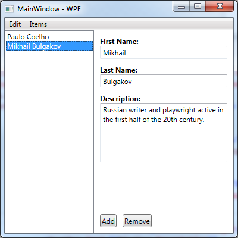

# UITestsExample
Example how to do UI testing for <i>WPF</i> and <i>WinForms</i> applications.

ExampleApplication.Logic
------------------------
Here is bussiness logic of the application. It is used for both <i>WPF</i> and also <i>WinForms</i> app version.

ExampleApplication.WinForms
---------------------------
The view layer for <i>WinForms</i>.

ExampleApplication.Wpf
---------------------------
The view layer for <i>WPF</i>.

ExampleApplication.UiTests.AppModel
-----------------------------------
For UI testing we need some interface to interact with the application. The interface models the applications UI from the user point of view. The interaction is made using <i>TestStack.White</i>.

ExampleApplication.Resources
----------------------------
Besides some usual resources there is a folder named <code>AutomationIdentifiers</code>. In this folder should be <i>UIAutomation</i> identifiers that are used in both the application and the application model to identify the controls.

ExampleApplication.ScreenRecorder
---------------------------------
Useful app to record the screen during the test.

ExampleApplication.UiTests
--------------------------
Here are the actual tests. Tests are written as XUnit tests using <code>ExampleApplication.UiTests.AppModel</code> to perform the UI interaction. One class per each test scenario.

Each test class inherits the <code>BaseTest</code> class. Each test runs a new application instance and starts recording. At the end of the test the recording is stopped. If the test succeeds the screen video is removed. If the test fails a screenshot is taken prior the application shutdown. Screenshots and videos are named according to the test.

To switch between <i>WPF</i> and <i>WinForms</i> platforms set a desired value to the <code>Platform</code> constant in the <code>BaseTest</code> class.
